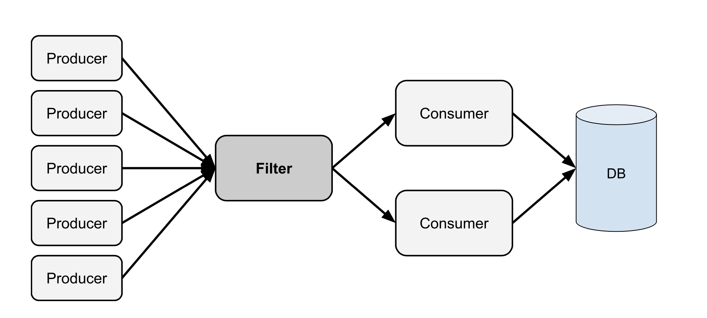

# CDSF-Microservice

## Concurrent Data Stream Filter Microservice

### Introduction

A concurrent data stream filter is a service for filtering and reducing data generated by producers before being sent to consumers. This type of specialized stream is commonly adopted when there’s consistently a large amount of incoming data but only a restricted memory is given.

More specifically, a filter is placed between a set of producers and consumers where the producers generate data at a greater rate than what the consumer can process. If the produced data doesn’t need to be consumed in its entirety and can be categorized with a score, the filter can be used to reduce the incoming data and only preserve the highest-scoring data. The filter also comes with a configurable max capacity, making it suitable for low and high-memory systems.



### Interface
```
Interface CDSFilter {
     Insert(item *Item) bool
     RemoveMax() *Item
     RemoveMin() *Item

     GetMax() *Item
     GetMin() *Item

     Clear() bool
     Size() int

     IsEmpty() bool
     IsFull() bool
}
```

### Proxy Service

The CDSF-Microservice employs gRPC as its primary communication method.
To use HTTP, we provide a HTTP to gRPC proxy service
(located in `services/proxy.go`).

### Kubernetes Setup

Coming soon.

### Benchmarking

Coming soon.

## Implementation

### Data Structure

Underlying data structure is a double-ended priority queue. This data structure 
was chosen because of its ability to access the largest or smallest item in 
O(log n) time.

### Concurrency Pattern

The heap is currently using a single coarse-grained reader-writer lock.
We plan to add a subtree-locking heap to improve scalability when running on a 
multicore shared memory machine.

### Language

Currently, the entire project is written in golang for simplicity. We intend to 
reimplement the apps (filters/heaps) in C++ for better performance and concurrency
control.
